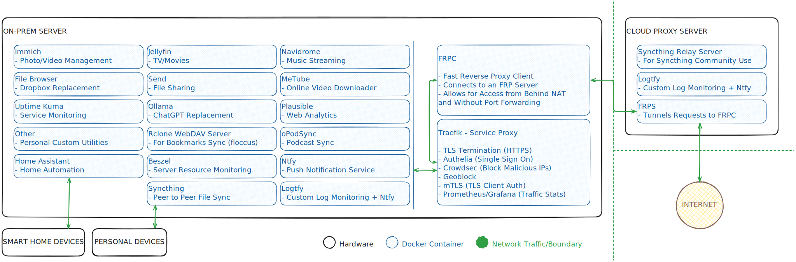

# Landscape

Docker-based setup for my self-hosted apps/services.

## Overview

- A home server runs several apps in Docker containers.
    - This includes [Immich](https://immich.app/), [Jellyfin](https://jellyfin.org/), [Home Assistant](https://www.home-assistant.io/), [ntfy](https://ntfy.sh/), etc.
    - All apps (with a few exceptions) are auto-updated by [Watchtower](https://containrrr.dev/watchtower/).
- Services are accessed via Traefik, which also provides TLS and various security features, including:
    - [Authelia](https://www.authelia.com/)
    - [CrowdSec](https://www.crowdsec.net/)
    - [Geoblock](https://plugins.traefik.io/plugins/62d6ce04832ba9805374d62c/geo-block) (for specific apps)
    - [mTLS](https://doc.traefik.io/traefik/https/tls/#client-authentication-mtls) (for specific apps)
- The home server has no public IP/ports, so requests to it are tunneled through a small cloud-based proxy server.
    - Request proxying is done with [FRP](https://github.com/fatedier/frp).
    - This has the additional benefit of hiding the home server's IP as all app domain/subdomain DNS entries point to the cloud proxy. 
- The cloud-based proxy also runs a few additional apps itself where appropriate (for example, [Syncthing Relay Server](https://docs.syncthing.net/users/strelaysrv.html)).

## Diagram

*Note: Diagram may be out of date.*

## Files

- Services are defined in Docker Compose files. Specifically:
    - `landscape.docker-compose.yaml`: Defines all services that run on the server (except FRPC).
    - `frpc.docker-compose.yaml`: Defines the FRPC service (this is separate because starting/stopping FRPC can be much riskier than for other services).
    - `landscape-remote.docker-compose.yaml`: Defines all services that run on the remote proxy.
- In order to have multiple instances of this setup (staging, production, etc.) and protect secret values from being checked in to Git, all environment-specific configuration and/or sensitive information is stored in environment-specific Git-ignored variable files.
    - `template.VARS.sh`: Example file used as a starting point for a user to define their own `VARS.sh` containing environment-specific variables and secrets.
    - For the install script to run, at least one of the following user-defined files must exist (listed in order of preference):
        - `VARS.production.sh`
        - `VARS.staging.sh`
        - `VARS.sh`
- Setup scripts:
    - `install.sh` and `install_remote.sh`: Scripts used to install and start services on the server and remote proxy respectively.
    - `simple_restart.sh`: Restart a running service.
    - `update_frp.sh`: Check for FRPC/FRPS updates and install them if needed (auto-updating these is too risky).
- Other files:
    - `fixed.VARS.sh`: Hardcoded variables used by various scripts.
    - `prep_env.sh`: Helper script used by various other scripts.
    - Everything in `files/`: Various files used to configure/initialize apps and/or used by the install scripts.
    - Everything in `mock_data/`: Data used to demo some services in a staging environment.
        - Some services depend on a specific directory hierarchy on the server. For example, Immich looks for images in `Main/Media/Camera/`.
        - The `mock_data` folder reflects this hierarchy.
        - In production, the root of this hierarchy would be the user's home directory (instead of `mock-data/`).

## Usage

1. Set up a server with outbound internet access.
    - Most of the code is distro-agnostic but a few lines are not. We assume the server is running Fedora 42.
    - We assume the server is running an x86-64 CPU and an AMD GPU with ROCm support.
    - The server must be powerful enough to run all apps defined in `landscape.docker-compose.yaml`.
    - If the server has a LUKS-encrypted drive (optional), a way to decrypt it remotely via SSH will be installed as part of the setup process.
2. Clone this repo on the server and create a copy of `template.VARS.sh` named `VARS.sh` (or `staging.VARS.sh` or `production.VARS.sh`). Fill in the values as appropriate. You may benefit from reading through the rest of these steps first.
3. Modify any of the source files in a fork of this repo, as appropriate to fit your needs.
    - This is optional since all user/environment-specific information comes from the user-defined `VARS.sh` file.
    - But this repo is tailored to the author's needs - it is likely that you will at least want to disable certain apps or change some hardcoded app settings.
4. Ensure the server contains the following directories as defined in your `VARS.sh` file:
    1. `MAIN_PARENT_DIR`: Your data, used by the apps.
        - This is typically just your home directory.
        - All apps that work with your personal data (photos, notes, etc.) expect that data to be stored in a specific folder structure inside this directory. You must create that structure and arrange your files accordingly - use `mock-data/` as a template to copy from.
    2. `STATE_DIR`: Persistent internal storage/state for all apps.
        - Set to `./state/` by default.
        - Running services exclusively rely on this folder and/or named Docker volumes to store their internal data.
        - The folder and everything in it is auto-generated and should not be modified.
        - Significance of the data varies on a per-app basis - some apps store ephemeral state (for example generated video thumbnails) while others store more important long-term data that should be backed up (for example Home Assistant settings).
3. Set up a proxy server with outbound and inbound internet access (public IP/ports).
    - Ensure it is reachable via SSH from your main server.
    - We assume this is running Ubuntu 24.04.
4. Purchase a domain for your apps, and set up DNS rules for each app subdomain, all pointing to the remote proxy server's IP.
    - For a list of all required subdomains, run: `source prep_env.sh; findDomainsInSetup`
5. Run `install_remote.sh` on the main server to remotely setup everything needed on the proxy server.
6. Run `install.sh` on the main server to install all apps/services on the main server.
7. Some apps require manual initialization after they have been installed.
    - It is dangerous to publicly expose these apps without initializing them, since they may allow for unauthorized access.
    - For this reason, certain apps are temporarily protected with Authelia authentication middleware upon initial install, even when those apps would not usually be protected in their final post-initialization state (due to having their own authentication, or having specific client needs that are not compatible with Authelia).
    - At this stage, you must manually complete the setup process for each of these apps. For a list of these apps' domains, run the following command: `source prep_env.sh; cat files/authelia.config.yaml | envsubst | grep -Eo 'domain:.+# IGNORE INITIALLY' | awk '{print $2}'`
    - Once finished, re-run `install.sh`. This time, the Authelia middleware will not apply to those apps.
8. Setup is complete.
    - Remember to occasionally run `./update_frp.sh` to keep FRP up to date.
    - Remember to occasionally run and `./install_remote.sh updateNonProxy` to keep other services on the proxy server up to date (the proxy server does not run Watchtower).